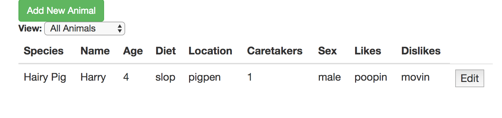

# _Tap Room_

#### _This application will track your zoo animals by name, age, number of caretakers, species, diet, current location, sex, and likes/dislikes._

#### By _**Aaron Rohrbacher**_

## Setup/Installation Requirements

* _Load your favorite terminal window. On a Mac, press `⌘ + ⇧`, type `terminal`, and press Enter._

* _In this terminal window, navigate to the directory in which you wish to save this project. I usually use my desktop (On a Mac) for current projects:_
```
$ cd ~/desktop
```

* _Clone this repository:_
```
$ git clone https://github.com/AaronRohrbacher/taproom
```

* _Navigate to the project's directory:_
```
$ cd taproom
```

* _Install Node.js if you haven't already! If you're on a Mac, I recommend [Homebrew](https://brew.sh/) for installation. If you're not on a Mac, or are unfamiliar with a command line, visit [NodeJs](https://nodejs.org) for installation instructions. The Node Package Manager (npm) is necessary to run this application. NOTE: Be sure your node version is at least 4.0, and that npm is at least 3.6!_

* _Mac with Homebrew instructions (skip this step if you already have node.js installed):_
```
$ brew install node
```

* _Now, run (definitely don't skip this step):_
```
$ npm install && bower install && gulp build && gulp serve
```

* _You should be seeing a website that looks like the screenshot below! If not, review your installations of Node.js, and Homebrew (if applicable). My apologies for my lack of knowledge beyond MacOS!_



## What it will do:

This program will allow the user to add new animals, view young or mature animals, and edit current animals. In the future, this app will group animals by species, and calculate how many caretakers may be needed on a given day. It will also look nicer! :)

_Aaron Rohrbacher: url(http://aaronrohrbacher.github.io/portfolio/)_

## Technologies Used
_Angular 2, HTML, CSS, JavaScript, jQuery, built and served locally with Bower and Gulp._

Copyright (c) 2017 **_Aaron Rohrbacher_**
